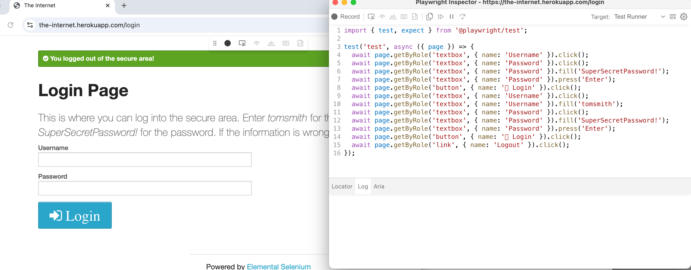

# PlaywrightAutomation

##Section 1
Commands to run a test: 
- npx playwright test --headed
- npx playwright show-report

##Section 2
Test site: https://the-internet.herokuapp.com/login
Command that Playwright's interactive code generation tool. It records your actions (clicks, typing, etc.). Playwright automatically generates test code (usually in JavaScript, TypeScript, Python, or C#) that you can use for automated browser testing. 
